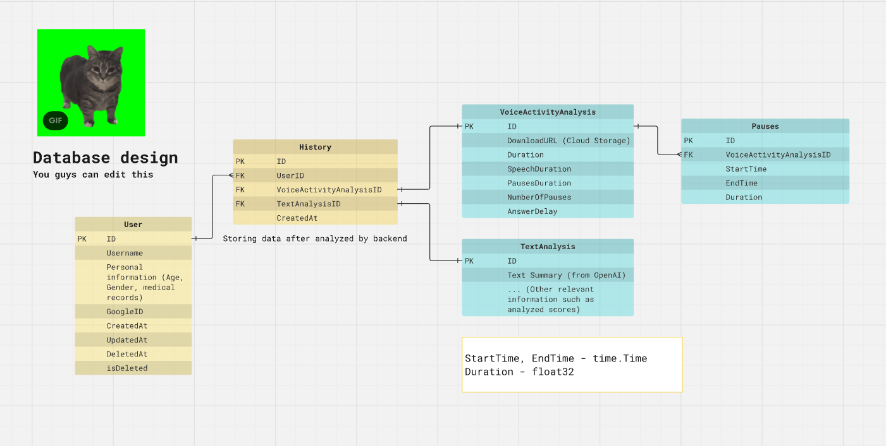

# Backend for healthhack 
## Todo list
- [ ] Set up database for users
- [ ] Google authentication
### Issues
- **Cannot connect to database:** Make sure not to use School Wifi to connect to database. You can use VPN to bypass though.
## Set up
Make sure to configure your `.env` file before starting the server.
```
PORT=YOUR_PORT_NUMBER (DEFAULT = 8080)
DSN=[YOUR_POSTGRESQL_URL]
```
Then, you can download relevant libraries and start the server.
``` bash
go mod download
go run cmd/server/main.go
```
## Database Design (Subjected to change)
You guys can edit the design from 
