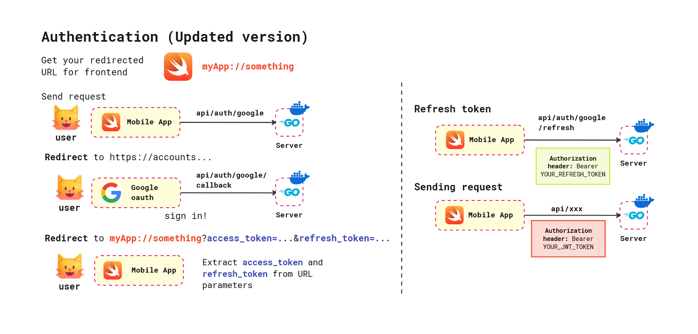

# Healthhack-backend 
- [Healthhack-backend](#healthhack-backend)
  - [1. About this project](#1-about-this-project)
    - [Roadmap](#roadmap)
  - [2. Set up](#2-set-up)
    - [Build and running app locally](#build-and-running-app-locally)
    - [Running with docker](#running-with-docker)
    - [Deployment](#deployment)
- [API Guide](#api-guide)
  - [HTTP codes](#http-codes)
  - [Headers](#headers)
  - [Endpoints](#endpoints)
    - [User endpoints `/api/users`](#user-endpoints-apiusers)
      - [Get user](#get-user)
      - [Update user](#update-user)
      - [Delete user](#delete-user)
    - [History endpoint `/api/history`](#history-endpoint-apihistory)
      - [Create empty history](#create-empty-history)
      - [Retrieve history by ID](#retrieve-history-by-id)
      - [Retrieve latest history (Including analyzed data)](#retrieve-latest-history-including-analyzed-data)
      - [Retrieve all histories (Including analyzed data)](#retrieve-all-histories-including-analyzed-data)
      - [Text analysis endpoint `/api/history/create-text-analysis`](#text-analysis-endpoint-apihistorycreate-text-analysis)
    - [Voice analysis endpoint `/internal/voice-analysis`](#voice-analysis-endpoint-internalvoice-analysis)
  - [Add/Update new voice analysis](#addupdate-new-voice-analysis)

## 1. About this project
### Roadmap
- [x] Set up database schema
- [x] User queries, mutation, Google authentication
- [x] API adding history
- [x] API Connect to open ai
## 2. Set up
### Build and running app locally
Clone the repository and install required repositories:
```bash
go mod download
```
Make sure to configure your `.env` file before starting the server.
```
PORT=8080
DSN=YOUR_POSTGRESQL_DB
OPENAI_TOKEN=YOUR_OPEN_AI_TOKEN
GOOGLE_CLIENT_ID=YOUR_GOOGLE_CLIENT_ID
GOOGLE_CLIENT_SECRET=YOUR_GOOGLE_CLIENT_SECRET
GOOGLE_REDIRECT_URL=YOUR_SERVER_URL
FRONTEND_REDIRECT_URL=YOUR_CLIENT_URL
JWT_SECRET=YOUR_JET_SECRET_KEY
ALLOWED_ORIGINS=YOUR_CLIENT_URL
ALLOWED_ORIGINS_INTERNAL=OTHER_INTERNAL_SERVICES_URL
```
Then, you can start the server.
``` bash
go run cmd/server/main.go
```
### Running with docker
To start the server, execute
```bash
docker build --network=host --tag healthhack-backend:latest .
```
To start the server, execute
```bash
docker run --env-file .env -d --name healthhack-backend -p 8080:8080 healthhack-backend:latest
```

If this server is settled properly, you would expect to find the message `"Welcome to our api server!"` at http://localhost:8080/.

To see a list of running containers, you can use the `docker ps` command. You would expect something like this.
```
CONTAINER ID   IMAGE                        COMMAND    CREATED         STATUS         PORTS                                       NAMES
<id>           healthhack-backend:latest   "./main"   2 minutes ago   Up 2 minutes   0.0.0.0:8080->8080/tcp, :::8080->8080/tcp   healthhack-backend
```
To stop the container, execute `docker stop <id>` or `docker stop healthhack-backend`. To remove the container, run `docker rm healthhack-backend`. 

### Deployment
This project used Google Cloud Platform (GCP) for deployment. Please follow the instruction from this [link](https://medium.com/novai-cloud-computing/gcp-docker-golang-deploying-a-go-application-to-google-cloud-container-registry-and-cloud-run-b5056324b5d0) for more details.  

# API Guide
This document provides detailed information about the available API endpoints, including request methods, parameters, responses, and error codes.

At this stage, **I have not set up any forms of authentication** (since I'm quite busy lately). Hence, this documentation is subjected to change.
## HTTP codes
* **StatusBadRequest (400)** The request was malformed. The request does not follow the schema guidelined by this documentation.
* **StatusInternalServerError (500)** The request is unsuccessfully processed due to internal server error.
## Headers
Most of our APIs require Authorization header. In our app, we use JWT Token to verify the users. Users have to log in through `/api/auth/google` in order to get the tokens. Here is the sample response after callback.
```json
{
  "access_token": "YOUR_ACCESS_TOKEN",
  "refresh_token": "YOUR_REFRESH_TOKEN"
}
```

Returning the tokens allows clients to store this information in a place that meets their needs. After the clients obtain the access token, please include them in the `Authorization` header. 
```
Authorization: Bearer YOUR_ACCESS_TOKEN
```
If the token is expired, you can refresh them by sending a request through `api/google/refresh` by putting your refresh token instead.
```
Authorization: Bearer YOUR_REFRESH_TOKEN
```
## Endpoints
### User endpoints `/api/users`
All user CRUD operations are performed based on user id specified in JWT Token.
#### Get user
* **Method**: GET
* **URL** `/api/users/get` 
* **Description** Get basic information for a user based on JWT Token defined in authorization header.
* **Example Response (If the user is founded)** 
```json
{
  "username": "username",
  "age": 10,
  "medical_record": "A single child with personal trauma"
}
```
* **Example Response (not founded)** 
```
record not found
User XXX not founded
```
#### Update user
* **Method**: PUT
* **URL** `/api/users/update` 
* **Description** Update user information based on user id.
* **Example body** Any other fields provided in the body will be updated accordingly.
```json
{
  "username": "username",
  "age": 10,
  "medical_record": "A single child with personal trauma"
}
```
* **Example Response** 
```json
{
  "username": "username",
  "age": 10,
  "medical_record": "A single child with personal trauma"
}
```
#### Delete user
* **Method**: PUT
* **URL** `/api/users/delete` 
* **Description** Delete user information based on user id.
* **Example Response** 
```json
"Successfully delete user id: USER_ID"
```
### History endpoint `/api/history`
Here is a general workflow on how to work with history endpoint.

#### Create empty history
**Add new voice analysis**
* **Method**: POST
* **URL** `/api/history/create`
* **Description** Create new empty history.
*  **Example response** The newly created history UUID.
```json
{
  "id": "HISTORY_UUID"
}
```
#### Retrieve history by ID
* **Method**: GET
* **URL** `/api/history/get-by-id?id=HISTORY_ID`
* **Example request** `api/history/get-by-id?id=a12-34`
* **Example response (some fields are truncated)**
```json
{
  "id":"1f020d38-6f1b-465c-b476-a31ae153b469",
  "user_id":"45d7c3cc-2a10-4de8-bb3d-ec8be81164e3",
  "voice_activity_analysis":{},
  "text_analysis":{},
}
```
#### Retrieve latest history (Including analyzed data)
* **Method**: GET
* **URL** `/api/history/get`
* **Example response (some fields are truncated)**
```json
{
  "id":"1f020d38-6f1b-465c-b476-a31ae153b469",
  "user_id":"45d7c3cc-2a10-4de8-bb3d-ec8be81164e3",
  "voice_activity_analysis":{},
  "text_analysis":{},
}
```
#### Retrieve all histories (Including analyzed data)
* **Method**: GET
* **URL** `/api/history/get`
* **Example request** `/api/history/get` get all histories
* **Example response (some fields are truncated)**
```json
[{
  "id":"1f020d38-6f1b-465c-b476-a31ae153b469",
  "user_id":"45d7c3cc-2a10-4de8-bb3d-ec8be81164e3",
  "voice_activity_analysis":{},
  "text_analysis":{},
}]
```
#### Text analysis endpoint `/api/history/create-text-analysis`
* **Method**: POST
* **URL** `/api/history/create-text-analysis`
* **Description** Create new text analysis record and save it into the database.
* **Example body**
```json
{
  "history_id": "HISTORY_UUID",
  "transcribed_text": "The weather is nice!"
} 
```
* **Example response**
```json
{
    "response": "TEXT ANALYSIS"
}
```
### Voice analysis endpoint `/internal/voice-analysis`
## Add/Update new voice analysis
* **Method**: POST
* **URL** `/internal/voice-analysis/create`
* **Description** Add voice analysis data from specified history ID.
*  **Example body** 
```JSON
{
  "history_id": "HISTORY_UUID", 
  "total_duration": 120.5,
  "total_speech_duration": 85.2,
  "total_pause_duration": 35.3,
  "num_speech_segments": 12,
  "num_pauses": 11,
  "answer_delay_duration": 1.8,
  "speech_segments": [
    {
      "start_time": 0.5,
      "end_time": 10.2,
      "duration": 9.7
    }
  ],
  "pause_segments": [
    {
      "start_time": 10.2,
      "end_time": 15.5,
      "duration": 5.3
    }
  ]
}
```
* **Example message (If success)**
```
Successfully update history 1f020e78-1f1b-965c-b476-a31ae153b469 with voice activity analysis 06b7e111-0cb9-46cf-97f1-ac7c6bb4f70e
```
